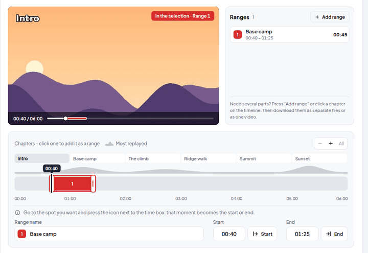
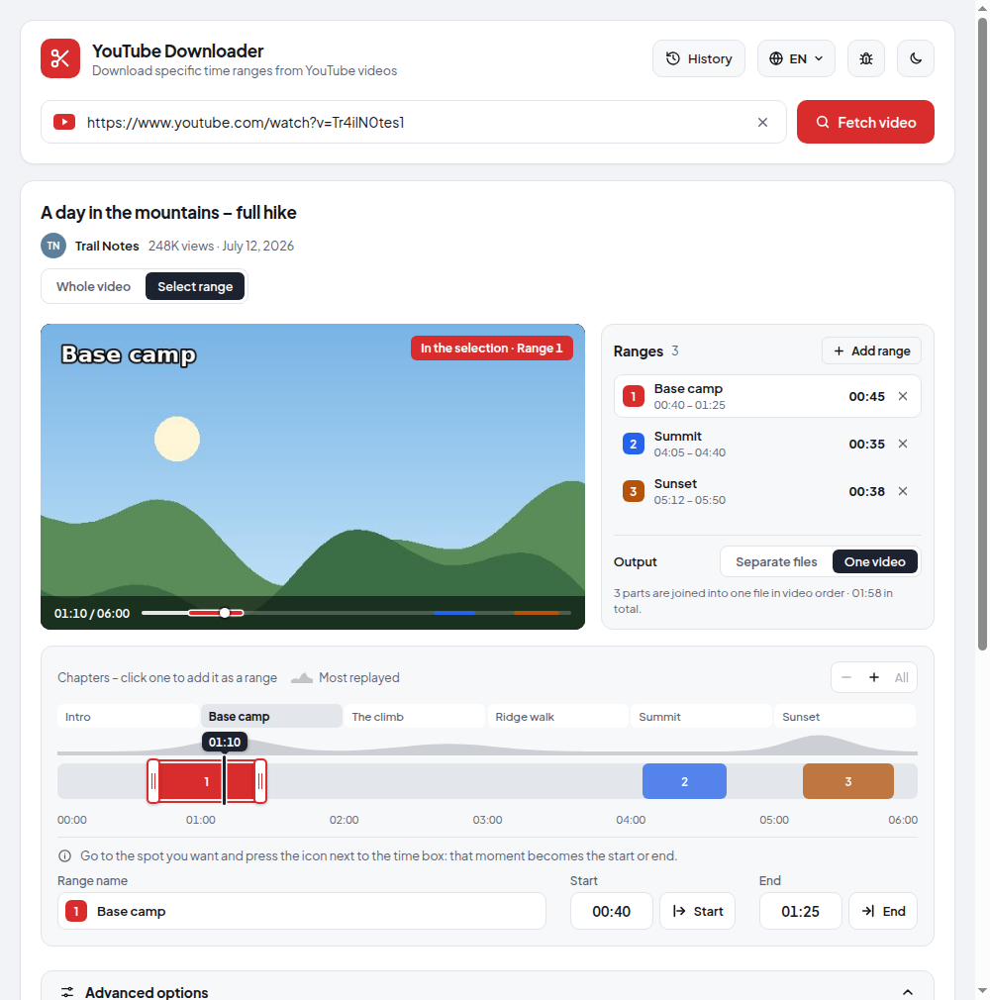
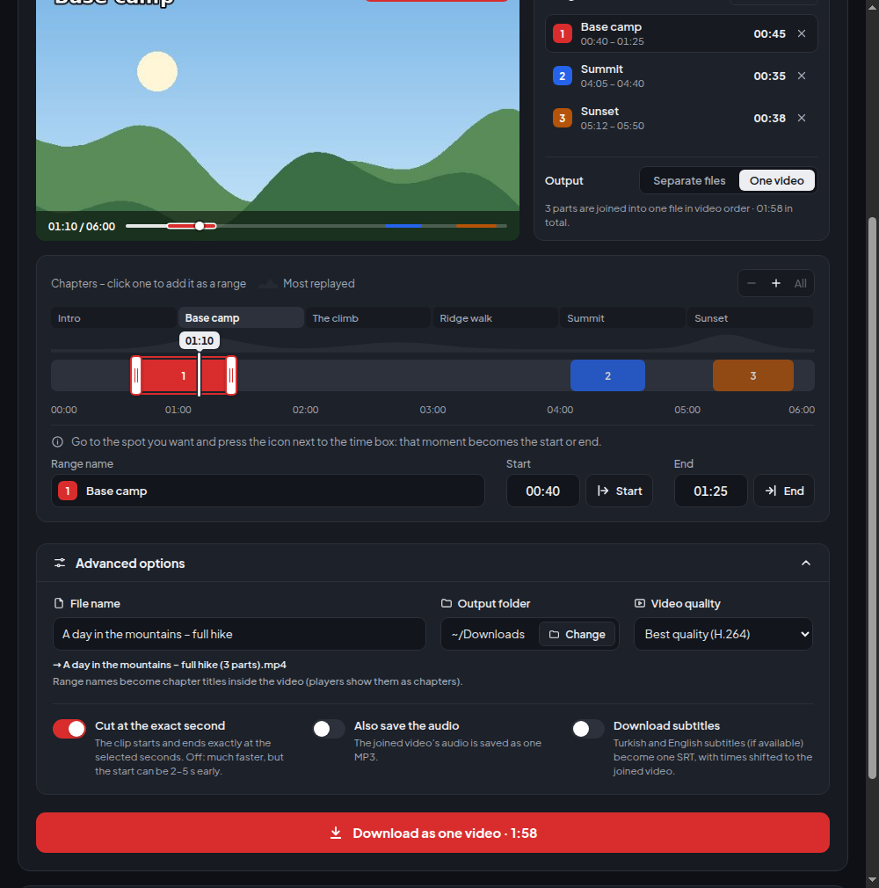

# YouTube Downloader

**Download just the part of a YouTube video you actually need.**

Pick one or more time ranges in a built-in player, press Download, and get a clean MP4 –
optionally with MP3 audio and subtitles. Free, no ads, no account, for macOS, Windows and Linux.

**⬇ Download:** [**macOS** (M1 and newer)](https://github.com/mehambas/youtube-downloader-releases/releases/latest/download/YouTube-Downloader-mac-arm64.dmg) &nbsp;·&nbsp; [**macOS** (Intel)](https://github.com/mehambas/youtube-downloader-releases/releases/latest/download/YouTube-Downloader-mac-x64.dmg) &nbsp;·&nbsp; [**Windows**](https://github.com/mehambas/youtube-downloader-releases/releases/latest/download/YouTube-Downloader-Setup.exe) &nbsp;·&nbsp; [**Linux**](https://github.com/mehambas/youtube-downloader-releases/releases/latest/download/YouTube-Downloader-Linux-x86_64.AppImage)

Which Mac do I have? Apple menu → <i>About This Mac</i>: “Chip: Apple M…” = M1 and newer, “Processor: Intel” = Intel.

[♥ Support on Ko-fi](https://ko-fi.com/mehambas91)

## Why?

You want the 40-second clip from a two-hour stream, the three good parts of a tutorial,
or just the song from a live set. Usually that means downloading the whole thing and
cutting it yourself. This app does both in one step – and only fetches what it needs.

## Features

- 🎬 **Watch while you select** – the video plays inside the app. Scrub the timeline and
  preview frames appear instantly, so you can find the right moment without guessing.
- ✂️ **Several ranges at once** – mark as many parts as you like, give them names, drag them
  around. Click a chapter to turn it into a range; the *Most replayed* graph shows where the
  interesting bits are.
- 🧩 **Separate files or one video** – save every range as its own file, or join them into a
  single video with chapter markers named after your ranges.
- 🎯 **Frame-accurate cuts** – clips start and end at exactly the second you picked
  (or turn it off for an even faster, keyframe-based cut).
- 🎵 **MP3 and subtitles** – get the audio as MP3 and subtitles as SRT, already trimmed to
  your clip.
- ⚡ **Fast** – the app measures your connection and picks the quickest way to get each clip.
  On a Mac it can cut using the built-in video chip.
- 📋 **Download queue** – add more videos while one is downloading; they run one after another.
- 🕘 **History** – find earlier downloads, open the files, or download the same range again.
- 🌗 **Light and dark theme**, English, German and Turkish interface.
- 🔄 **Stays up to date** – the app updates itself and keeps its download engine current,
  so it keeps working when YouTube changes things.

  
  

## Download

| System | Download |
| --- | --- |
| **macOS** – Apple Silicon (M1 and newer) | [YouTube-Downloader-mac-arm64.dmg](https://github.com/mehambas/youtube-downloader-releases/releases/latest/download/YouTube-Downloader-mac-arm64.dmg) |
| **macOS** – Intel | [YouTube-Downloader-mac-x64.dmg](https://github.com/mehambas/youtube-downloader-releases/releases/latest/download/YouTube-Downloader-mac-x64.dmg) |
| **Windows** 10 / 11 | [YouTube-Downloader-Setup.exe](https://github.com/mehambas/youtube-downloader-releases/releases/latest/download/YouTube-Downloader-Setup.exe) – or [Portable](https://github.com/mehambas/youtube-downloader-releases/releases/latest/download/YouTube-Downloader-Portable.exe), no install needed |
| **Linux** | [AppImage](https://github.com/mehambas/youtube-downloader-releases/releases/latest/download/YouTube-Downloader-Linux-x86_64.AppImage) or [.deb](https://github.com/mehambas/youtube-downloader-releases/releases/latest/download/YouTube-Downloader-Linux-amd64.deb) |

Not sure which Mac you have? Open the Apple menu → **About This Mac**. “Chip: Apple M1/M2/…” means
Apple Silicon, “Processor: Intel” means Intel.

Older versions and release notes: [all releases](https://github.com/mehambas/youtube-downloader-releases/releases).
Everything the app needs (yt-dlp, ffmpeg, …) is included – there is nothing else to install.

### First launch

The app is not signed with a paid developer certificate, so your system will warn you once:

- **macOS:** open the DMG and drag the app into *Applications*. When macOS says it
  *cannot verify the developer*, open **System Settings → Privacy & Security** and click
  **Open Anyway**.
- **Windows:** if SmartScreen shows *Windows protected your PC*, click **More info → Run anyway**.

## How to use it

1. Copy a YouTube link and paste it into the app – the video loads automatically.
2. Keep **Whole video**, or switch to **Select range** and mark the parts you want
   (play the video, then press **Start** / **End**, or drag on the timeline).
3. Choose *Separate files* or *One video*, open **Advanced options** for quality, MP3 and
   subtitles if you like, and press **Download**.

## Support the project

This app is completely free. If you find it useful, you can optionally support its development:

Support is entirely voluntary and does not provide any additional features, services or benefits.

## Good to know

- Please only download videos you have the right to download, and respect the creators'
  rights and YouTube's Terms of Service.
- Found a bug or have an idea? [Open an issue](https://github.com/mehambas/youtube-downloader-releases/issues).
- Built with [yt-dlp](https://github.com/yt-dlp/yt-dlp), [FFmpeg](https://ffmpeg.org) and
  [Electron](https://www.electronjs.org). Not affiliated with YouTube or Google.
